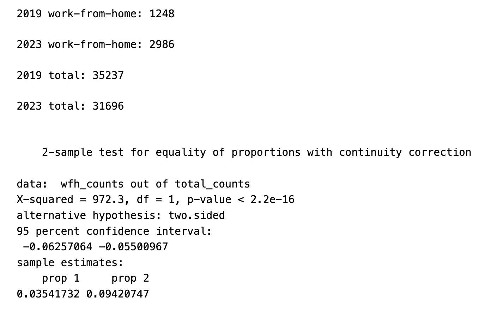
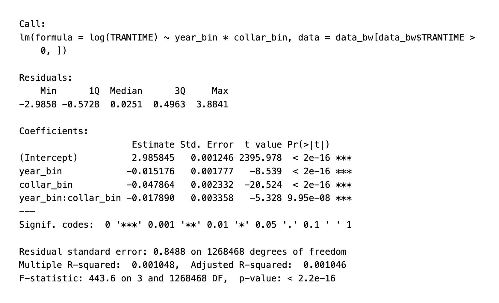

```{css, echo=FALSE}
* {
  background-color: white;
}

body, html {
  background-color: white;
}

/* Style for non-closeread content (centered) */
.content > p,
.content > blockquote {
  max-width: 700px;
  margin: 0 auto 1.5em;
  font-family: Georgia, serif;
  font-size: 1.15em;
  line-height: 1.25;
  padding: 0 2em;
}

/* Typography for closeread sections */
.cr-section p {
  font-family: Georgia, serif;
  font-size: 1em;
  line-height: 1.25;
  margin-bottom: 1em;
}

/* First paragraph (lede) */
.content > p:first-of-type {
  font-size: 1.15em;
  font-weight: 500;
  line-height: 1.2;
  margin-top: 2em;
}

/* Section headers */
strong {
  font-size: 1.2em;
  display: block;
  margin-top: 2.5em;
  margin-bottom: 1em;
  color: #2c3e50;
}

/* Make bullet lists match body text */
ul, ol {
  font-family: Georgia, serif;
  font-size: 1em;
  line-height: 1.25;
  max-width: 700px;
  margin: 0 auto 1.5em;
  padding-left: 2em;
}

li {
  font-family: Georgia, serif;
  font-size: 1em;
  line-height: 1.25;
  margin-bottom: 0.5em;
}
```

```{r setup, include=FALSE}
#Load the dataset
library(ipumsr)
library(scales)
library(dplyr) 
library(ggplot2)  

ddi <- read_ipums_ddi("/Users/beeb/Downloads/usa_00002.xml")
data <- read_ipums_micro(ddi)

##############
#DATA CLEANING
##############

#Create an indicator variable for whether individual is employed or not. 1 = employed, 0 = everything else (N/A, unemployed, not in labor force, unknown/illegible)
data$EMPLOYED <- ifelse(data$EMPSTAT == 1, 1, 0)

#Create an indicator variable for whether individual is doing remote work or not. 
data$REMOTE <- ifelse(data$TRANWORK == 80, 1, 0)

#Create an indicator variable  for whether individual lives in NY, NY
data$INNY <- ifelse(data$PWCOUNTY == 061, 1, 0)

#Group White Collar Workers by Industry Code
white_inds <- c(
  4070:4590,   # Wholesale Trade
  4670:5790,   # Retail Trade
  728:760,   # Information
  810:829,   # Finance and Insurance, and Real Estate, and Rental and Leasing
  828:859,   # Educational Services, and Health Care and Social Assistance
  900:939,    # Arts, Entertainment, and Recreation
  12321:12321 #Public Administration)
)

blue_inds <- c(
  0170:0490,   # Agriculture Forestry, Fishing Hunting
  1070:3990,   # Manufacturing
  6070:6390,   # Transportation and Warehousing, and Utilities
  0570:0690,  #Utilities 
  7580:7790,   # Administrative and support and waste management services
  8660:8690,   # Accommodation and Food Services
  8770:9290   # Other Services, Except Public Administration
)

#Create one multi-category variable
data$collar <- NA_character_ 
# White-collar
data$collar[data$IND %in% white_inds] <- "white"

# Blue-collar
data$collar[data$IND %in% blue_inds] <- "blue"

# Everyone else (optional)
data$collar[is.na(data$collar)] <- "other"

data$white_collar <- ifelse(data$collar == "white", 1, 0)
data$blue_collar <- ifelse(data$collar == "blue", 1, 0)


#######
#ANSWERING BIG QUESTIONS
#######

#In 2019, XX amount of people were doing remote work. In 2023, XX amount of people were doing remote work.
remote_2019_ny <- sum(
  data$REMOTE == 1 &
    data$INNY == 1 &
    data$YEAR == 2019,
  na.rm = TRUE
)

remote_2023_ny <- sum(
  data$REMOTE == 1 &
    data$INNY == 1 &
    data$YEAR == 2023,
  na.rm = TRUE
)

#Remote counts by collar
remote_2019_blue <- sum(
  data$REMOTE == 1 &
    data$INNY == 1 &
    data$YEAR == 2019 &
    data$collar == "blue",
  na.rm = TRUE
)

remote_2023_blue <- sum(
  data$REMOTE == 1 &
    data$INNY == 1 &
    data$YEAR == 2023 &
    data$collar == "blue",
  na.rm = TRUE
)

remote_2019_white <- sum(
  data$REMOTE == 1 &
    data$INNY == 1 &
    data$YEAR == 2019 &
    data$collar == "white",
  na.rm = TRUE
)

remote_2023_white <- sum(
  data$REMOTE == 1 &
    data$INNY == 1 &
    data$YEAR == 2023 &
    data$collar == "white",
  na.rm = TRUE
)

#Median commute time for all employed people in 2019
#NON remote
median_2019_overall <- median(
  data$TRANTIME[
    data$YEAR == 2019 &
      data$EMPSTAT == 1 &
      data$INNY == 1 &
      (data$white_collar == 1 | data$blue_collar == 1) &
      data$REMOTE == 0 &           # Exclude remote workers
      data$TRANTIME > 0           # Only positive commute times
  ],
  na.rm = TRUE
)

#Median commute time for white collar workers in 2019
median_2019_white <- median(
  data$TRANTIME[
    data$YEAR == 2019 &
      data$EMPSTAT == 1 &
      data$INNY == 1 &
      data$white_collar == 1 &
      data$REMOTE == 0 &           # Exclude remote workers
      data$TRANTIME > 0           # Only positive commute times
  ],
  na.rm = TRUE
)

#Median commute time for blue collar workers in 2019
median_2019_blue <- median(
  data$TRANTIME[
    data$YEAR == 2019 &
      data$EMPSTAT == 1 &
      data$INNY == 1 &
      data$blue_collar == 1 & 
      data$REMOTE == 0 &           # Exclude remote workers
      data$TRANTIME > 0           # Only positive commute times
  ],
  na.rm = TRUE
)

#Median commute time for all employed people in 2023
median_2023_overall <- median(
  data$TRANTIME[
    data$YEAR == 2023 &
      data$EMPSTAT == 1 &
      data$INNY == 1 &
      (data$white_collar == 1 | data$blue_collar == 1) &
      data$REMOTE == 0 &           # Exclude remote workers
      data$TRANTIME > 0           # Only positive commute times
  ],
  na.rm = TRUE
)

#Median commute time for white collar workers in 2023
median_2023_white <- median(
  data$TRANTIME[
    data$YEAR == 2023 &
      data$EMPSTAT == 1 &
      data$INNY == 1 &
      data$white_collar == 1 &
      data$REMOTE == 0 &           # Exclude remote workers
      data$TRANTIME > 0           # Only positive commute times
  ],
  na.rm = TRUE
)

#Median commute time for blue collar workers in 2023
median_2023_blue <- median(
  data$TRANTIME[
    data$YEAR == 2023 &
      data$EMPSTAT == 1 &
      data$INNY == 1 &
      data$blue_collar == 1 &
      data$REMOTE == 0 &           # Exclude remote workers
      data$TRANTIME > 0           # Only positive commute times
  ],
  na.rm = TRUE
)

# Create commute_data for visualizations
commute_data <- data %>%
  filter(
    EMPSTAT == 1,           # Employed
    INNY == 1,              # Lives in NYC
    !is.na(TRANTIME)        # Has commute time data
  ) %>%
  mutate(
    Year = as.factor(YEAR),
    Occupation = case_when(
      white_collar == 1 ~ "White-collar",
      blue_collar == 1 ~ "Blue-collar",
      TRUE ~ "Other"
    ),
    log_TRANTIME = log(TRANTIME + 1)  # For histogram visualizations
  ) %>%
  filter(Occupation %in% c("White-collar", "Blue-collar"))  # Keep only white/blue collar
```


**March 2020.** The Big Apple. The Empire City. The city that never sleeps. A dense metropolis of crowded streets, yellow taxi cabs, and bustling pedestrians—tourists and locals alike. New York City isn't quiet or still by any means. Yet in March of 2020, the COVID-19 pandemic emptied the once-busy office towers of Manhattan in weeks. 

What started out as a "temporary" emergency shutdown became a longer experiment in remote work patterns that would eventually reshape how millions of Americans spend their workdays today. Four years later, the pandemic has since receded from daily life, but its effects still echo. A key question remains: **How permanently have these changes altered workplace patterns in New York City?** 

...and did all workers experience these changes equally?

<div style="text-align: center; margin: 2em auto; max-width: 800px;">
  
</div>

**Research Question:** Among people who are employed, is there any relationship between 2019 versus 2023 workplace changes and commute times in New York, NY (Manhattan), and do these changes vary between white-collar and blue-collar workers?

**About the Data**
Our analysis examines work commute patterns using data from the American Community Survey (ACS) accessed from IPUMS USA, comparing employed residents of New York County (Manhattan) in 2019 and 2023. Now, what does this data look like, and how was it collected? 

We specifically look at the ACS 2019 and 2023 samples, which are 1-in-100 national random (weighted) samples of the population. For both, the questionnaires contain 44 unique questions about topics such as education, employment, income, housing, and transportation. 

The ACS has been sent out via mail since 1950. Here's what the question about commute time looks like, for example: 

Q. How many minutes did it usually take this person to get from home to work LAST WEEK?

We selected variables capturing employment status, work industry, means of transportation to work, and commute time. Initially, our dataset had 6,645,362 observations and 16 variables. 

**Data Cleaning & Methodology**
To answer our research question, we first needed to carefully consider how to clean our data. Summarized below are some of our decisions:
**1. Missingness Strategy** We believe the missingness in our variables is not at random since survey respondents had the option not to respond to a given question. Thus, there may be underlying factors we are unaware of and that the data systematically misses. We grouped nonresponses into clearly defined categories rather than treating the commute times as zeros. 
**2. Remote Work Classification** One of the variables we extracted from IPUMS corresponded to the respondent's primary means of transportation to work over the course of the previous week, and it included an option for "Worked at home." This is how we classified remote workers.	
**3. Employment Filter** We created a binary indicator variable for whether a person was employed or not. Only employed workers were included in our analysis.
**4. Geographic Filter** We restricted our dataset to New York County (Manhattan), which we identified and filtered by the county code variable.
**5. Occupational Classification** We used Census industry codes to classify workers. White-collar: wholesale/retail, information, finance, education, health care, arts, public administration. Blue-collar: agriculture, manufacturing, transportation, construction, food services, and other services.

These approaches allow us to create reliable indicators for employed individuals living in New York County and to group them into white-collar and blue-collar categories based on industry codes. 

Next, we can begin to address two key aspects of our research question:
**1. How Many People Worked Remotely?**
The most dramatic shift appears in the adoption of remote work. 

::: {.cr-section layout="sidebar-right"}

:::{#cr-remote-totals}
```{r fig.width=8, fig.height=6}
library(dplyr)
library(ggplot2)
library(scales)

# Calculate total employed workers by year
total_2019_ny <- sum(data$EMPSTAT == 1 & data$INNY == 1 & data$YEAR == 2019, na.rm = TRUE)
total_2023_ny <- sum(data$EMPSTAT == 1 & data$INNY == 1 & data$YEAR == 2023, na.rm = TRUE)

# Calculate proportions
remote_summary <- data.frame(
  Year = c("2019", "2023"),
  Remote_Workers = c(remote_2019_ny, remote_2023_ny),
  Total_Workers = c(total_2019_ny, total_2023_ny)
) %>%
  mutate(Proportion = Remote_Workers / Total_Workers)

ggplot(remote_summary, aes(x = Year, y = Proportion)) +
  geom_col(fill = "#787878ff", width = 0.6, alpha = 0.9) +
  geom_text(aes(label = sprintf("%.1f%%", Proportion * 100)), 
            vjust = -0.5, size = 6, fontface = "bold") +
  scale_y_continuous(
                  labels = percent, 
                  limits = c(0, 0.1),
                  breaks = seq(0, 0.1, by = 0.025),
                  expand = expansion(mult = c(0, 0.15))
  ) +
  labs(
    title = "Remote Work Surged in Manhattan",
    subtitle = "Proportion of employed workers working from home",
    x = NULL,
    y = "Proportion Working Remotely",
    caption = "Source: American Community Survey via IPUMS USA"
  ) +
  theme_minimal(base_size = 14) +
  theme(
    plot.title = element_text(face = "bold", size = 18, margin = margin(b = 5)),
    plot.subtitle = element_text(size = 13, color = "gray30", margin = margin(b = 15)),
    plot.caption = element_text(size = 10, color = "gray50", hjust = 0, margin = margin(t = 10)),
    panel.grid.minor = element_blank(),
    panel.grid.major.x = element_blank()
  )
```
:::

In 2019, `r percent(remote_2019_ny / total_2019_ny, accuracy = 0.1)` of the reported employed ACS respondents in Manhattan were doing remote work. By 2023, that percentage rose to `r percent(remote_2023_ny / total_2023_ny, accuracy = 0.1)`. @cr-remote-totals

Remote work increased in Manhattan between 2019 and 2023, indicating a shift in how people engaged with their workplaces, even after the pandemic ended. 

:::{#cr-remote-props-blue}
```{r fig.width=8, fig.height=6}
library(dplyr)
library(ggplot2)
library(scales)

# Calculate total employed workers by year for blue collar
total_2019_blue <- sum(data$EMPSTAT == 1 & data$INNY == 1 & data$YEAR == 2019 & data$collar == "blue", na.rm = TRUE)
total_2023_blue <- sum(data$EMPSTAT == 1 & data$INNY == 1 & data$YEAR == 2023 & data$collar == "blue", na.rm = TRUE)

# Calculate proportions
remote_summary_blue <- data.frame(
  Year = c("2019", "2023"),
  Remote_Workers = c(remote_2019_blue, remote_2023_blue),
  Total_Workers = c(total_2019_blue, total_2023_blue)
) %>%
  mutate(Proportion = Remote_Workers / Total_Workers)

ggplot(remote_summary_blue, aes(x = Year, y = Proportion)) +
  geom_col(fill = "#2c5f8d", width = 0.6, alpha = 0.9) +
  geom_text(aes(label = sprintf("%.1f%%", Proportion * 100)), 
            vjust = -0.5, size = 6, fontface = "bold") +
  scale_y_continuous(
                  labels = percent, 
                  limits = c(0, 0.1),
                  breaks = seq(0, 0.1, by = 0.025),
                  expand = expansion(mult = c(0, 0.15))
  ) +
  labs(
    title = "Blue-collar Workers Working From Home",
    subtitle = "Proportion of employed blue-collar workers who worked remotely",
    x = NULL,
    y = "Proportion Working Remotely",
    caption = "Source: American Community Survey via IPUMS USA"
  ) +
  theme_minimal(base_size = 14) +
  theme(
    plot.title = element_text(face = "bold", size = 18, margin = margin(b = 5)),
    plot.subtitle = element_text(size = 13, color = "gray30", margin = margin(b = 15)),
    plot.caption = element_text(size = 10, color = "gray50", hjust = 0, margin = margin(t = 10)),
    panel.grid.minor = element_blank(),
    panel.grid.major.x = element_blank()
  )
```
:::

We can further break down our observations by looking at white-collar versus blue-collar workers. In 2019, `r percent(remote_2019_blue / total_2019_blue, accuracy = 0.1)` employed blue-collar respondents in Manhattan were doing remote work. By 2023, `r percent(remote_2023_blue / total_2023_blue, accuracy = 0.1)` blue-collar employed people worked remotely. @cr-remote-props-blue

:::{#cr-remote-props-white}
```{r fig.width=8, fig.height=6}
library(dplyr)
library(ggplot2)
library(scales)

# Calculate total employed workers by year for white collar 
total_2019_white <- sum(data$EMPSTAT == 1 & data$INNY == 1 & data$YEAR == 2019 & data$collar == "white", na.rm = TRUE)
total_2023_white <- sum(data$EMPSTAT == 1 & data$INNY == 1 & data$YEAR == 2023 & data$collar == "white", na.rm = TRUE)

# Calculate proportions
remote_summary_white <- data.frame(
  Year = c("2019", "2023"),
  Remote_Workers = c(remote_2019_white, remote_2023_white),
  Total_Workers = c(total_2019_white, total_2023_white)
) %>%
  mutate(Proportion = Remote_Workers / Total_Workers)

ggplot(remote_summary_white, aes(x = Year, y = Proportion)) +
  geom_col(fill = "#d97532", width = 0.6, alpha = 0.9) +
  geom_text(aes(label = sprintf("%.1f%%", Proportion * 100)), 
            vjust = -0.5, size = 6, fontface = "bold") +
  scale_y_continuous(
                  labels = percent, 
                  limits = c(0, 0.1),
                  breaks = seq(0, 0.1, by = 0.025),
                  expand = expansion(mult = c(0, 0.15))
  ) +
  labs(
    title = "White-collar Workers Working From Home",
    subtitle = "Proportion of employed white-collar workers who worked remotely",
    x = NULL,
    y = "Proportion Working Remotely",
    caption = "Source: American Community Survey via IPUMS USA"
  ) +
  theme_minimal(base_size = 14) +
  theme(
    plot.title = element_text(face = "bold", size = 18, margin = margin(b = 5)),
    plot.subtitle = element_text(size = 13, color = "gray30", margin = margin(b = 15)),
    plot.caption = element_text(size = 10, color = "gray50", hjust = 0, margin = margin(t = 10)),
    panel.grid.minor = element_blank(),
    panel.grid.major.x = element_blank()
  )
```
:::

As for the white-collar workers: in 2019, `r percent(remote_2019_white / total_2019_white, accuracy = 0.1)` employed respondents in Manhattan worked remotely, and by 2023, `r percent(remote_2023_white / total_2023_white, accuracy = 0.1)` people worked remotely. @cr-remote-props-white

We can see that remote work similarly increased in Manhattan between 2019 and 2023 for both blue and white-collar workers, which is consistent with the increases for all employed respondents in our data subset. 

**...but is any of this significant?**

**Let's take a look!**

:::

We can conduct a two-sample proportion z-test to see whether the difference in these proportions over time is significant. Let's check our test assumptions first:

**1. Independence**
ACS uses random sampling, so this assumption is satisfied.
**2. Random Sampling**
ACS is a random sample of the population, so this assumption is also satisfied.
**3. Sample Size**
We need at least 10 successes and 10 failures in each group:
2019: 1,248 remote, 33,989 not remote.
2023: 2,986 remote, 28,710 not remote.
This assumption is satisfied.
**4. Independent Samples**
We have no reason to believe the 2019 and 2023 samples are dependent.

::: {.cr-section layout="sidebar-left"}

Running the test in R, the output is as follows:@cr-ztest-base

:::{#cr-ztest-base}
```{=html}
<style>
.ztest-container {
  position: relative;
  width: 100%;
  max-width: 700px;
  margin: 0 auto;
}
.ztest-container img {
  width: 100%;
  display: block;
}
.ztest-highlight {
  position: absolute;
  background: rgba(255, 193, 7, 0.3);
  pointer-events: none;
}
</style>

<div class="ztest-container">
  
</div>
```
:::

Notice the X-squared statistic: @cr-ztest-chisq

:::{#cr-ztest-chisq}
```{=html}
<div class="ztest-container">
  
  <div class="ztest-highlight" style="top: 61%; left: 2.5%; width: 24%; height: 5%;"></div>
</div>
```
:::

The X-squared value of 972.3 is extremely large, indicating a significant difference. @cr-ztest-chisq

Now, look at the p-value: @cr-ztest-pvalue

:::{#cr-ztest-pvalue}
```{=html}
<div class="ztest-container">
  
  <div class="ztest-highlight" style="top: 61%; left: 37.25%; width: 24%; height: 5%;"></div>
</div>
```
:::

The p-value < 2.2e-16 means this difference is highly statistically significant. @cr-ztest-pvalue

Finally, the confidence interval: @cr-ztest-ci

:::{#cr-ztest-ci}
```{=html}
<div class="ztest-container">
  
  <div class="ztest-highlight" style="top: 76.5%; left: 2.5%; width: 34%; height: 5%;"></div>
</div>
```
:::

We can see from the z-test output that the proportion of Manhattan residents working from home increased significantly from roughly 3.5% in 2019 to 9.4% in 2023 (p < 0.001). We are 95% confident that the true population difference lies somewhere between 5.5 and 6.3 percentage points (95% CI: [-0.063, -0.055]). @cr-ztest-ci

Because the confidence interval doesn't include zero, we have further evidence that there's a meaningful increase in the proportion of residents working from home from 2019 to 2023.

:::

Overall, the evidence suggests that there is a significant difference in the remote work proportions between 2019 and 2023. Although we can't definitively state that the pandemic was the sole cause of such differences, we may speculate that the rise of remote and hybrid work from 2019 to 2023 has reshaped how New Yorkers in Manhattan travel to work. 

**2. What Were the Median Commute Times?**
For workers who still commute to their physical workplaces, how have travel times changed? 

::: {.cr-section layout="sidebar-right"}

:::{#cr-medians-2019}
```{r fig.width=8, fig.height=6}
library(dplyr)
library(ggplot2)

# Prepare data for boxplots - filter for in-person workers only
boxplot_data <- data %>%
  filter(
    EMPSTAT == 1,           # Employed
    INNY == 1,              # Lives in NYC
    REMOTE == 0,            # Exclude remote workers
    TRANTIME > 0,           # Only positive commute times
    !is.na(TRANTIME)        # Has commute time data
  ) %>%
  mutate(
    Year = as.factor(YEAR),
    Category = case_when(
      white_collar == 1 ~ "White-collar",
      blue_collar == 1 ~ "Blue-collar",
      TRUE ~ "Other"
    )
  )

# Combine with category-specific data
boxplot_all <- boxplot_data %>% 
  filter(Category %in% c("White-collar", "Blue-collar"))

# Filter for 2019 ONLY - no invisible boxes
boxplot_2019 <- boxplot_all %>% filter(Year == "2019")

# Create boxplot
ggplot(boxplot_2019, aes(x = Category, y = TRANTIME, fill = Year)) +
  geom_boxplot(position = position_nudge(x = -0.2), alpha = 0.9, outlier.alpha = 0.3, width = 0.38) +
  scale_fill_manual(values = c("2019" = "#2c5f8d")) +
  labs(
    title = "Manhattan Commute Times by Industry",
    subtitle = "Among workers who commute to a workplace (excluding remote workers)",
    x = NULL,
    y = "Commute Time (minutes)",
    fill = "Year",
    caption = "Source: American Community Survey via IPUMS USA"
  ) +
  theme_minimal(base_size = 14) +
  theme(
    plot.title = element_text(face = "bold", size = 18, margin = margin(b = 5)),
    plot.subtitle = element_text(size = 13, color = "gray30", margin = margin(b = 15)),
    legend.position = "top",
    panel.grid.minor = element_blank(),
    panel.grid.major.x = element_blank()
  ) +
  coord_cartesian(ylim = c(0, 120))
```
:::

The median commute time in our 2019 data subset was `r median_2019_white` minutes for non-remote white-collar workers and `r median_2019_blue` minutes for non-remote blue-collar workers. Combined, the overall median for white and blue-collar workers was `r median_2019_overall` minutes. @cr-medians-2019

:::{#cr-medians}
```{r fig.width=8, fig.height=6}
library(dplyr)
library(ggplot2)

# Prepare data for boxplots - filter for in-person workers only
boxplot_data <- data %>%
  filter(
    EMPSTAT == 1,           # Employed
    INNY == 1,              # Lives in NYC
    REMOTE == 0,            # Exclude remote workers
    TRANTIME > 0,           # Only positive commute times
    !is.na(TRANTIME)        # Has commute time data
  ) %>%
  mutate(
    Year = as.factor(YEAR),
    Category = case_when(
      white_collar == 1 ~ "White-collar",
      blue_collar == 1 ~ "Blue-collar",
      TRUE ~ "Other"
    )
  )

# Combine with category-specific data
boxplot_all <- boxplot_data %>% 
  filter(Category %in% c("White-collar", "Blue-collar"))

# Create boxplots
ggplot(boxplot_all, aes(x = Category, y = TRANTIME, fill = Year)) +
  geom_boxplot(position = position_dodge(width = 0.8), alpha = 0.9, outlier.alpha = 0.3) +
  scale_fill_manual(values = c("2019" = "#2c5f8d", "2023" = "#d97532")) +
  labs(
    title = "Manhattan Commute Times by Industry",
    subtitle = "Among workers who commute to a workplace (excluding remote workers)",
    x = NULL,
    y = "Commute Time (minutes)",
    fill = "Year",
    caption = "Source: American Community Survey via IPUMS USA"
  ) +
  theme_minimal(base_size = 14) +
  theme(
    plot.title = element_text(face = "bold", size = 18, margin = margin(b = 5)),
    plot.subtitle = element_text(size = 13, color = "gray30", margin = margin(b = 15)),
    legend.position = "top",
    panel.grid.minor = element_blank(),
    panel.grid.major.x = element_blank()
  ) +
  coord_cartesian(ylim = c(0, 120))  # Focus on 0-120 minutes
```
:::

By 2023, these times changed to `r median_2023_white` minutes for white-collar workers and `r median_2023_blue` minutes for blue-collar workers, with an overall median of `r median_2023_overall` minutes. Both groups showed similar modest decreases. @cr-medians

:::

To test whether median commute times changed significantly between 2019 and 2023 for in-person workers, we used a Wilcoxon rank sum test. Why? It's a non-parametric test that's appropriate for skewed data and robust to outliers. Note that this test focuses specifically on white-collar and blue-collar workers combined, as these represent the primary groups in our analysis. 

The test revealed a statistically significant difference (W = 60,760,598, p = 1.11e-8), confirming that commute times did decrease for in-person workers. However, the practical magnitude is quite small (`r median_2019_overall` to `r median_2023_overall` minutes).

This rank sum test confirms what our visualizations suggest: the more important story is that of composition: who is commuting, not how long are those commutes?

**The Distribution of Commute Times**
To understand the more about our data, let's examine the distributions of commute times for in-person workers. 

These histograms show the log-transformed values, which make the patterns more visible.

Looking first at 2019, we can see the pre-pandemic baseline. 

::: {.cr-section layout="sidebar-right"}

:::{#cr-dist-2019}
```{r fig.width=8, fig.height=6}
library(dplyr)
library(ggplot2)

nonzero_2019 <- commute_data %>% 
  filter(TRANTIME > 0, Year == "2019") %>%
  mutate(log_TRANTIME = log(TRANTIME))  # Recalculate without +1

nonzero_2019 <- nonzero_2019 %>%
  group_by(Occupation) %>%
  mutate(prop = 1 / n()) %>%
  ungroup()

ggplot(nonzero_2019, aes(x = log_TRANTIME, weight = prop, fill = Occupation)) +
  geom_histogram(bins = 35, alpha = 0.75, position = "identity", color = "white", linewidth = 0.3) +
  scale_fill_manual(values = c("Blue-collar" = "#2c5f8d", "White-collar" = "#d97532")) +
  facet_wrap(~Occupation, ncol = 2) +  
  labs(
    title = "2019: Pre-Pandemic Commute Patterns",
    subtitle = "Log-transformed travel time for in-person workers",
    x = "Log of Commute Time",
    y = "Percentage of Workers",
    caption = "Source: American Community Survey via IPUMS USA",
    fill = NULL
  ) +
  scale_y_continuous(labels = scales::percent_format()) +
  coord_cartesian(ylim = c(0, 0.2)) +
  theme_minimal(base_size = 14) +
  theme(
    plot.title = element_text(face = "bold", size = 18, margin = margin(b = 5)),
    plot.subtitle = element_text(size = 13, color = "gray30", margin = margin(b = 15)),
    legend.position = "top",
    legend.text = element_text(size = 13),
    strip.text = element_text(face = "bold", size = 15),
    panel.grid.minor = element_blank()
  )
```
:::

The distributions show substantial similarity between blue-collar and white-collar commuters. Both groups show the characteristic right-skewed pattern of urban commute times typical of dense cities with public transit systems. @cr-dist-2019

Now let's examine 2023 to see how patterns changed. @cr-dist-2023

:::{#cr-dist-2023}
```{r fig.width=8, fig.height=6}
library(dplyr)
library(ggplot2)

nonzero_2023 <- commute_data %>% 
  filter(TRANTIME > 0, Year == "2023") %>%
  mutate(log_TRANTIME = log(TRANTIME)) 

nonzero_2023 <- nonzero_2023 %>%
  group_by(Occupation) %>%
  mutate(prop = 1 / n()) %>%
  ungroup()

ggplot(nonzero_2023, aes(x = log_TRANTIME, weight = prop, fill = Occupation)) +
  geom_histogram(bins = 35, alpha = 0.75, position = "identity", color = "white", linewidth = 0.3) +
  scale_fill_manual(values = c("Blue-collar" = "#2c5f8d", "White-collar" = "#d97532")) +
  facet_wrap(~Occupation, ncol = 2) + 
  labs(
    title = "2023: Post-Pandemic Commute Patterns",
    subtitle = "Log-transformed travel time for in-person workers",
    x = "Log of Commute Time",
    y = "Percentage of Workers",
    caption = "Source: American Community Survey via IPUMS USA",
    fill = NULL
  ) +
  scale_y_continuous(labels = scales::percent_format()) +
  coord_cartesian(ylim = c(0, 0.2)) +
  theme_minimal(base_size = 14) +
  theme(
    plot.title = element_text(face = "bold", size = 18, margin = margin(b = 5)),
    plot.subtitle = element_text(size = 13, color = "gray30", margin = margin(b = 15)),
    legend.position = "top",
    legend.text = element_text(size = 13),
    strip.text = element_text(face = "bold", size = 15),
    panel.grid.minor = element_blank()
  )
```
:::

In 2023, the distributions look very similar to 2019. The shapes remained stable between the two time periods. @cr-dist-2023

Comparing the two years side-by-side confirms the stability. @cr-dist-both

:::{#cr-dist-both}
```{r fig.width=8, fig.height=6}
library(dplyr)
library(ggplot2)

nonzero_data <- commute_data %>% 
  filter(TRANTIME > 0) %>%
  mutate(log_TRANTIME = log(TRANTIME))  # Recalculate without +1

nonzero_data <- nonzero_data %>%
  group_by(Occupation, Year) %>%
  mutate(prop = 1 / n()) %>%
  ungroup()

ggplot(nonzero_data, aes(x = log_TRANTIME, weight = prop, fill = Occupation)) +
  geom_histogram(bins = 35, alpha = 0.75, position = "identity", color = "white", linewidth = 0.3) +
  facet_grid(Occupation ~ Year) +  # Creates a 2x2 grid: rows = Occupation, columns = Year
  scale_fill_manual(values = c("Blue-collar" = "#2c5f8d", "White-collar" = "#d97532")) +
  labs(
    title = "Commute Time Distributions Remained Similar Across Time",
    subtitle = "Log-transformed travel time for in-person workers (excluding remote workers)",
    x = "Log of Commute Time",
    y = "Percentage of Workers",
    fill = NULL,
    caption = "Note: Original commute times range from 1 to 200+ minutes; log transformation compresses scale"
  ) +
  scale_y_continuous(labels = scales::percent_format()) +
  theme_minimal(base_size = 14) +
  theme(
    plot.title = element_text(face = "bold", size = 18, margin = margin(b = 5)),
    plot.subtitle = element_text(size = 13, color = "gray30", margin = margin(b = 15)),
    plot.caption = element_text(size = 10, color = "gray50", hjust = 0, margin = margin(t = 10)),
    legend.position = "top",
    legend.text = element_text(size = 13),
    strip.text = element_text(face = "bold", size = 13),
    panel.grid.minor = element_blank()
  )
```
:::

:::

The following visualization is a slopegraph of remote work share by year and industry. In other words, the percentage of remote workers between 2019 and 2023, visualized specifically to show a slope relationship.

::: {.cr-section layout="sidebar-right"}

Remote work rose for blue-collar workers... @cr-slopegraph_blue

:::{#cr-slopegraph_blue}
```{r fig.width=8, fig.height=6}
library(dplyr)
library(ggplot2)

# Keep only blue collar workers
data_bw <- data[data$blue_collar == 1, ]

#Recode year as binary, 0=2019 1=2023
data_bw$year_bin <- ifelse(data_bw$YEAR == 2023, 1, 0)

remote_slope <- data_bw %>%
  filter(INNY == 1, YEAR %in% c(2019, 2023)) %>%
  mutate(Occupation = "Blue-collar") %>% 
  group_by(Year = YEAR, Occupation) %>% 
  summarise(
    remote_rate = mean(REMOTE == 1, na.rm = TRUE),
    .groups = "drop"
  )

# ADD DUMMY WHITE COLLAR DATA
dummy_white <- data.frame(
  Year = c(2019, 2023),
  Occupation = "White-collar",
  remote_rate = NA
)

remote_slope <- bind_rows(remote_slope, dummy_white)

ggplot(remote_slope, aes(x = Year, y = remote_rate, color = Occupation, group = Occupation)) +
  geom_line(linewidth = 1.5, na.rm = TRUE) +
  geom_point(size = 4, na.rm = TRUE) +
  scale_color_manual(
    values = c("Blue-collar" = "#2c5f8d", "White-collar" = "#d97532")
  ) +
  scale_x_continuous(breaks = c(2019, 2023), limits = c(2018.5, 2023.5)) +
  scale_y_continuous(
    labels = scales::percent_format(),
    limits = c(0, NA)
  ) +
  labs(
    title = "Rise of Remote Work in Manhattan by Industry",
    subtitle = "Share of employed workers who are remote in 2019 vs 2023",
    x = "",
    y = "Remote Work Rate",
    color = "Occupation",
    caption = "Source: American Community Survey via IPUMS USA"
  ) +
  theme_minimal(base_size = 14) +
  theme(
    plot.title = element_text(face = "bold", hjust = 0.5),
    plot.subtitle = element_text(hjust = 0.5)
  )
```
:::

...AND for white-collar workers between 2019 and 2023. @cr-slopegraph

White-collar workers were slightly more remote in 2019, but by 2023, things switched: blue-collar workers worked remotely slightly more. @cr-slopegraph

:::{#cr-slopegraph}
```{r fig.width=8, fig.height=6}
library(dplyr)
library(ggplot2)

# Keep only white or blue collar workers
data_bw <- data[data$white_collar == 1 | data$blue_collar == 1, ]

# Binary variable: 1 = white, 0 = blue
data_bw$collar_bin <- ifelse(data_bw$white_collar == 1, 1, 0)

#Recode year as binary, 0=2019 1=2023
data_bw$year_bin <- ifelse(data_bw$YEAR == 2023, 1, 0)

remote_slope <- data_bw %>%
  filter(INNY == 1, YEAR %in% c(2019, 2023)) %>%
  mutate(
    Occupation = ifelse(collar_bin == 1, "White-collar", "Blue-collar")
  ) %>%
  group_by(Year = YEAR, Occupation) %>%
  summarise(
    remote_rate = mean(REMOTE == 1, na.rm = TRUE),
    .groups = "drop"
  )

ggplot(remote_slope, aes(x = Year, y = remote_rate, color = Occupation, group = Occupation)) +
  geom_line(linewidth = 1.5) +
  geom_point(size = 4) +
  scale_color_manual(values = c("Blue-collar" = "#2c5f8d", "White-collar" = "#d97532")) +
  scale_x_continuous(breaks = c(2019, 2023), limits = c(2018.5, 2023.5)) +
  scale_y_continuous(
    labels = scales::percent_format(),
    limits = c(0, NA)
  ) +
  labs(
    title = "Rise of Remote Work in Manhattan by Industry",
    subtitle = "Share of employed workers who are remote in 2019 vs 2023",
    x = "",
    y = "Remote Work Rate",
    caption = "Source: American Community Survey via IPUMS USA"
  ) +
  theme_minimal(base_size = 14) +
  theme(
    plot.title = element_text(face = "bold", hjust = 0.5),
    plot.subtitle = element_text(hjust = 0.5)
  )
```
:::

:::

**Regression Analysis**
Because commute times were originally zero-inflated due to the responses of remote workers, we run a single linear regression only for those who actually commute to work. Furthermore, because commute times were right skewed, we log transformed the commute times. 

We included year as a predictor, which allows us to test whether commute times changed from 2019 to 2023. We included collar type as a predictor, which allows us to test whether those changes differ for white- collar and blue-collar workers. 

The equation for the commuter-only regression model with these two predictors: 

$$\log(\text{TRANTIME}) = \hat{\beta}_0 + \hat{\beta}_1(\text{YEAR}) + \hat{\beta}_2(\text{COLLAR}) + \hat{\beta}_3(\text{YEAR} \times \text{COLLAR})$$

**Assumptions:**
Before getting into our regression analysis, let's first address the assumptions for the regression:

::: {.cr-section layout="sidebar-left"}

:::{#cr-resid}
```{r fig.width=10, fig.height=6}
library(dplyr)
library(ggplot2)

# Prepare data
data_bw <- data[data$white_collar == 1 | data$blue_collar == 1, ]
data_bw$collar_bin <- ifelse(data_bw$white_collar == 1, 1, 0)
data_bw$year_bin <- ifelse(data_bw$YEAR == 2023, 1, 0)

commuters <- data_bw %>%
  filter(TRANTIME > 0, INNY == 1) %>%
  mutate(
    log_trantime = log(TRANTIME),
    Group = case_when(
      year_bin == 0 & collar_bin == 0 ~ "2019 Blue-collar",
      year_bin == 0 & collar_bin == 1 ~ "2019 White-collar",
      year_bin == 1 & collar_bin == 0 ~ "2023 Blue-collar",
      year_bin == 1 & collar_bin == 1 ~ "2023 White-collar"
    )
  )

model_nonzero <- lm(log_trantime ~ year_bin * collar_bin, data = commuters)
commuters$fitted <- fitted(model_nonzero)
commuters$residuals <- residuals(model_nonzero)

set.seed(123)
commuters_sample <- commuters %>% sample_n(min(5000, nrow(commuters)))

# Residual plot with group labels
ggplot(commuters_sample, aes(x = fitted, y = residuals, color = Group)) +
  geom_jitter(alpha = 0.3, size = 1, height = 0) +
  geom_hline(yintercept = 0, linetype = "dashed", color = "red", linewidth = 1) +
  scale_color_manual(values = c(
    "2019 Blue-collar" = "#1f4788",
    "2019 White-collar" = "#c2692a", 
    "2023 Blue-collar" = "#2c5f8d",
    "2023 White-collar" = "#d97532"
  )) +
  labs(
    title = "Residual Plot: Checking Regression Assumptions",
    subtitle = "Four groups based on Year × Occupation combinations",
    x = "Fitted Values (Predicted log of Commute Time)",
    y = "Residuals",
    color = "Group",
    caption = "Source: American Community Survey via IPUMS USA"
  ) +
  theme_minimal(base_size = 14) +
  theme(
    plot.title = element_text(face = "bold", size = 16),
    plot.subtitle = element_text(size = 12, color = "gray30"),
    legend.position = "right",
    panel.grid.minor = element_blank()
  )
```
:::

**1. Linearity** In the visualization on the right, we see four distinct vertical bands of residuals scattered randomly around zero. Thus there is no curved pattern or trend across the fitted values, which confirms the linear relationship is appropriate. @cr-resid
**2. Constant variance** We see that all four groups show similar vertical spread (roughly -3 to +1.5), and the variance appears fairly constant across groups. 
**3. Normality** Most points cluster around zero, with relatively symmetric spread above and below. For large samples like ours, however, linear regression is robust to the normality assumption. 
**4. Independence** We have no evidence of dependence here. Each person's commute time appears independent of others', and we have no reason to believe otherwise.
**5. No Multicollinearity** Year and occupation are independent variables, and being in 2019 vs 2023 isn't determined by collar type.

:::

**Run the regression:**
Now, let's take a close look at the regression output from R: 

::: {.cr-section layout="sidebar-left"}

:::{#cr-reg-base}
```{=html}
<style>
.reg-container {
  position: relative;
  width: 100%;
  max-width: 900px;
  margin: 0 auto;
}
.reg-container img {
  width: 100%;
  display: block;
}
.highlight-box {
  position: absolute;
  background: rgba(255, 193, 7, 0.3);
  pointer-events: none;
}
</style>

<div class="reg-container">
  
</div>
```
:::

Here's the regression equation: @cr-reg-formula

:::{#cr-reg-formula}
```{=html}
<div class="reg-container">
  
  <div class="highlight-box" style="top: 9.75%; left: 2.5%; width: 95%; height: 10%;"></div>
</div>
```
:::

First, let's look at the year coefficient, highlighted on the right: @cr-reg-year

:::{#cr-reg-year}
```{=html}
<div class="reg-container">
  
  <div class="highlight-box" style="top: 54%; left: 2.5%; width: 69%; height: 5%;"></div>
</div>
```
:::

This shows commute times decreased slightly from 2019 to 2023, but the effect is small. @cr-reg-year

Second, let's look at the collar coefficient: @cr-reg-collar

:::{#cr-reg-collar}
```{=html}
<div class="reg-container">
  
  <div class="highlight-box" style="top: 58.5%; left: 2.5%; width: 69%; height: 5%;"></div>
</div>
```
:::

White-collar workers have meaningfully shorter commutes than blue-collar workers. @cr-reg-collar

Finally, we have the interaction term: @cr-reg-interaction

:::{#cr-reg-interaction}
```{=html}
<div class="reg-container">
  
  <div class="highlight-box" style="top: 63%; left: 2.5%; width: 69%; height: 5%;"></div>
</div>
```
:::

The decline over time is slightly larger (more negative) for white-collar workers compared to blue-collar workers. @cr-reg-interaction

:::

**Interpretation:** After removing remote workers from our analysis, commute times among in-person commuters declined only slightly between 2019 and 2023. While median commute times were similar across both groups in both years, white-collar workers had slightly shorter average commutes and fewer extremely long commutes. The regression coefficients align with our visualizations: the small year effect (-0.015) confirms the modest decline we observed in the boxplots, while the collar coefficient (-0.048) quantifies the subtle white-collar advantage visible in the distribution tails. The significant interaction term indicates that the decline was slightly more pronounced for white-collar workers. 

---

**Conclusion**
Our analysis reveals that the pandemic's effect on Manhattan commute patterns was primarily driven by changes in who commutes rather than how long they commute. The percentage of remote workers increased from `r percent(remote_2019_ny / total_2019_ny, accuracy = 0.1)` in 2019 to `r percent(remote_2023_ny / total_2019_ny, accuracy = 0.1)` in 2023, while physical commute times for in-person workers remained relatively stable.

Both blue-collar and white-collar workers experienced similar increases in remote work adoption, with blue-collar workers reaching slightly higher remote work rates by 2023 (8.0% vs 7.7%). 

Four years after the pandemic first forced millions of workers to adapt to remote working, our data suggests that shifts toward more flexible work arrangements could be here to stay. Exploration of ACS data for post-2023 years might provide further insights about the longer-term stability of such patterns. 

**Limitations**
It's worth mentioning a few limitations of our research design. First, our analysis compares two cross-sections, as opposed to data on the same individuals over time. Second, industry-based occupation classification might misclassify some workers, especially in vague or ambiguous industries. Third, we might not be able to identify hybrid workers, and their commute times may not be fully accurate. Fourth, our large sample size means that even small effects could be statistically significant. Fifth, other factors during the period between 2019 and 2023 may have influenced commute patterns, not just the pandemic, including: economic shifts, changes in housing costs, general technological use, etc. We cannot isolate the pandemic’s effect from the changes we observed. Finally, any results specific to Manhattan may not be generalizable to other American cities or even the other boroughs of New York City.

**Ethical Considerations**
ACS data is anonymized to protect respondent privacy, and we want to make clear that our results should not be used to discriminate in any way. Furthermore, disparities in remote work access raise equity concerns.

**Challenges Faced**
One challenge was how to deal with zero-inflation in commute times, which we ultimately decided to address by focusing on a subset of our data (non-remote workers.) Industry codes also required manual grouping based on personal judgment calls. Lastly, balancing statistical detail with effective communication in the scrollytelling format has been an interesting and rewarding challenge!


---

**Data Source:** IPUMS USA, University of Minnesota (www.ipums.org). American Community Survey samples from 2019 and 2023, restricted to employed residents of New York County (Manhattan).
**Image Credit:** Mikołaj Kołodziejczyk via Pexels 
**Authors:** Sabrina Wang and Beatrix Kim | STAT 260 Final Project 2025
